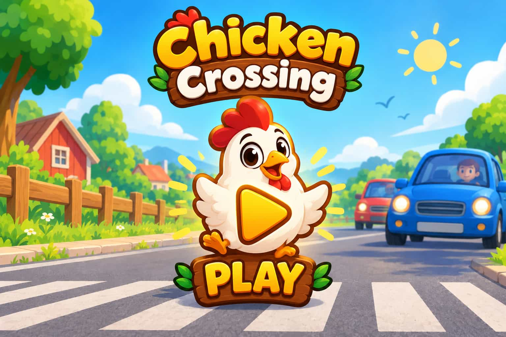
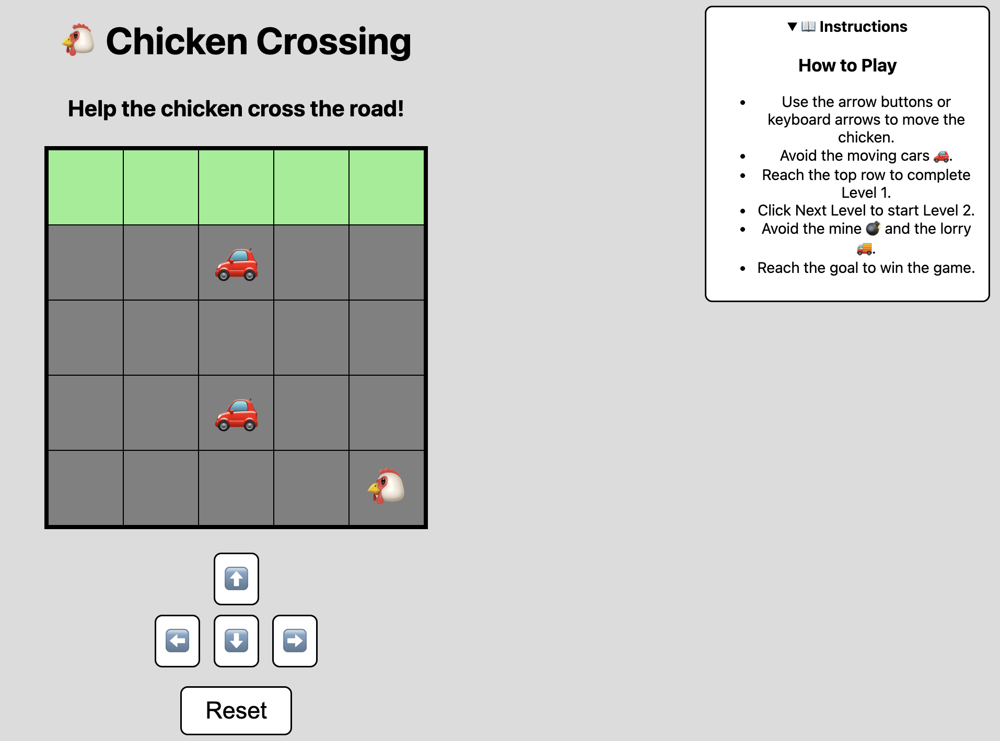
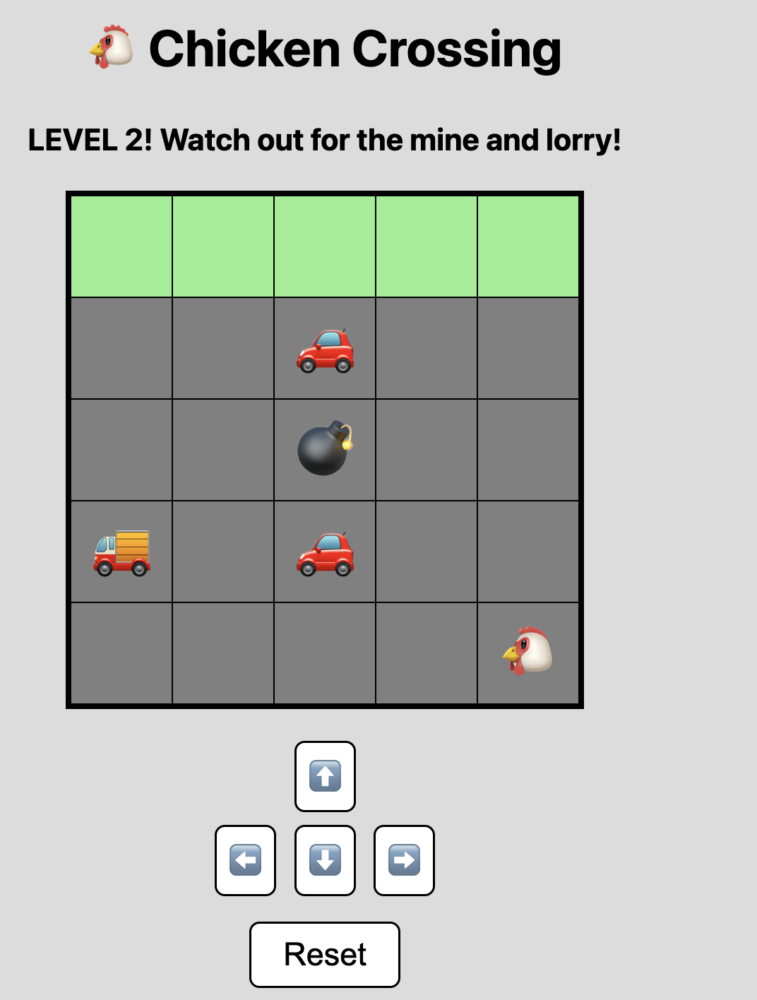

# 🐔 Chicken Crossing

### By: Marko Kaludjerović
#### [GitHub](https://github.com/masjobest-git) 

#### Date: October 2026

***

### ***Description***

#### Chicken Crossing is a simple browser-based game where the player helps a chicken safely cross a dangerous road. The game was developed using JavaScript, HTML, and CSS as a learning project focused on game logic, DOM manipulation, event handling, collision detection, and timers.

***

### ***Technologies Used***

* JavaScript
* HTML
* CSS

***

### ***Getting Started***

####

* Click the Play button on the intro screen.
* Use the arrow buttons or keyboard arrow keys to move the chicken.
* Avoid the moving cars.
* Reach the top row to complete Level 1.
* Click the "Next Level" button to start Level 2.
* Avoid the cars, mine, and lorry.
* Reach the goal to win the game.
* Enjoy yourself!

***

### ***Future Updates***

- [ ] Add sound effects
- [ ] Add score tracking
- [ ] Add additional levels
- [ ] Add more obstacles
- [ ] Add difficulty settings
- [ ] Improve animations

***

### ***Screenshots***

#### Chicken Crossing Intro Screen

#### Chicken Crossing Game Board LEVEL 1

#### Chicken Crossing Game Board LEVEL 2

***

### ***Credits***

#### Support and Help: Software Engineering Immersive @ General Assembly

#### Pictures: Custom project assets

#### Inspiration: Aleksandar, Sam and Kam